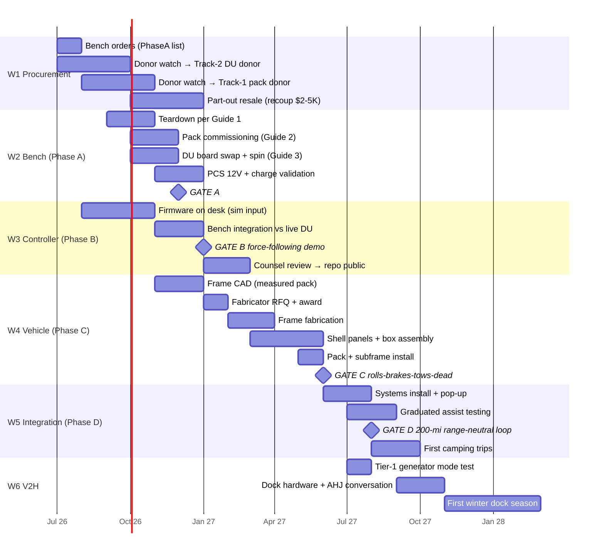

# Flagship Build Roadmap — v1.0

**Date:** 2026-07-09 | **Owner:** TJ | **Governs:** the physical build, today → first winter dock season
**Companions:** `Flagship_First_Build_Plan_v0_1.md` (what & why, phases/gates), `Flagship_Integration_Matrix_v0_1.md` (parts completeness), `engineering/PhaseA_Bench_Procurement.md` (order list). This doc adds **when** — sequenced, dated, dependency-honest. Dates are targets with the project's standing rule: gates don't get waived to recover schedule; versions extend instead.

## The one-line arc

**Bench organs by year-end 2026 → rolling chassis by early summer 2027 → range-neutral behind the Model Y August 2027 → first V2H winter 2027–28.**

## This week (July 2026)

1. **Order the bench** — `PhaseA_Bench_Procurement.md`, top table (~$1,900): LilyGo ×2, ZombieVerter (longest lead), load cell + amplifier, commissioning consumables
2. **Check Maguire V3.2 availability + fresh field reports** (evbmw shop, openinverter forum) — order the DU board + PCS board if reports are decent
3. **Review the 8 AM donor briefings**; approve/reject; first bids when the filter says so
4. Book the **counsel session** for ~Q4 (no urgency; calendar it so it exists)

## Workstream detail & dependencies

**W1 — Procurement (now → autumn).** Two donors, remember: the cheap 2021–2023 **DU donor can land first** and unblocks half the bench — don't wait for the perfect pack car. Pack donor: 2024–25 LFP, hail/rear, patience over price-chasing. Part-out starts as soon as teardown finishes; resale funds Phase C materials.

**W2 — Bench / Phase A (donor-gated).** Guides #1→#2→#3 in order per donor arrival; PCS validation is the D-F2 gate (12V spine viability — the one architecture bet still unproven; Elcon+DC-DC fallback pre-planned if Highland PCS refuses the open controller). **Gate A (target Dec 2026):** pack ≥80% SoH commissioned + DU spins under openinverter + PCS 2 kW/1 hr.

**W3 — Controller / Phase B (starts NOW, donor-independent).** Firmware per Guide #4 runs on the desk against simulated force input from August — this is the workstream with slack, so it absorbs donor delays productively. Live-DU integration after Gate A hardware exists. **Gate B (target Jan 2027):** scripted force-profile tracking + all faults dropping clean, on video. Counsel session gates only the *public repo*, not the work.

**W4 — Vehicle / Phase C (pack-measurement-gated).** CAD starts the week the pack is measured (SS05a checklist governs). RFQ to ≥2 fabricators; award ≤$6K. Shell panels per SS04 sample winner. **Gate C (target June 2027):** rolls, brakes via E/H actuator, tows dead behind a bigger tug at low speed.

**W5 — Integration / Phase D.** Systems, pop-up, then graduated assist testing: closed course walking-pace → 25 mph → highway, fail-safes exercised at every step. **Gate D (target Aug 2027) — the money gate:** Model Y tows the loaded flagship 200 miles at ≤5% net range loss; every fault drops to freewheel. Then: camping.

**W6 — V2H.** Tier-1 generator mode tests during Phase D (nearly free). Dock hardware + the AHJ conversation in fall; **first winter dock season Nov 2027** — the trailer's second job begins.

## Budget phasing (against the $21–28K envelope)

| When | Spend | Running |
|---|---|---|
| Jul–Aug 2026 | Bench hardware ~$3.5K | $3.5K |
| Aug–Oct 2026 | Two donors all-in ~$8–14K | $12–17K |
| Oct 2026–Jan 2027 | Part-out resale **−$2–5K** | $9–14K |
| Jan–Mar 2027 | Frame + shell materials ~$8–10K | $17–23K |
| Apr–Jul 2027 | Systems + interior ~$4–5K | $21–28K ✓ |
| Sep–Oct 2027 | V2H dock (Solis etc.) ~$3.5K | *outside envelope — it's house infrastructure, offsets OEM V2H at $4–10K* |

## Slip policy & the three watch-items

Per the original roadmap doctrine: no external deadline, a one-quarter slip is acceptable, gates never get waived. The three things most likely to move dates, with pre-planned responses: **(1) donor drought** → widen radius before widening filter; **(2) Highland PCS fails its gate** → Elcon + 400→12V DC-DC fallback, ~$2.5K, two-week delay, not a redesign; **(3) Maguire V3.2 field reports go bad** → hold at bench, contribute fixes upstream — the board maturing IS the community project.

## Definition of done (v1.0 of the trailer)

The Model Y tows a camping-ready, ≤3,500 lb flagship 200 miles at ≈zero net range loss; it camps off-grid on its own pack and solar; it comes home and powers the house through a winter; and every step of how — donor to dock — is published where the next builder can follow it.

---
*v1.0, 2026-07-09. Review monthly against donor-watch reality; re-baseline dates at each gate. The mermaid chart renders on GitHub.*
