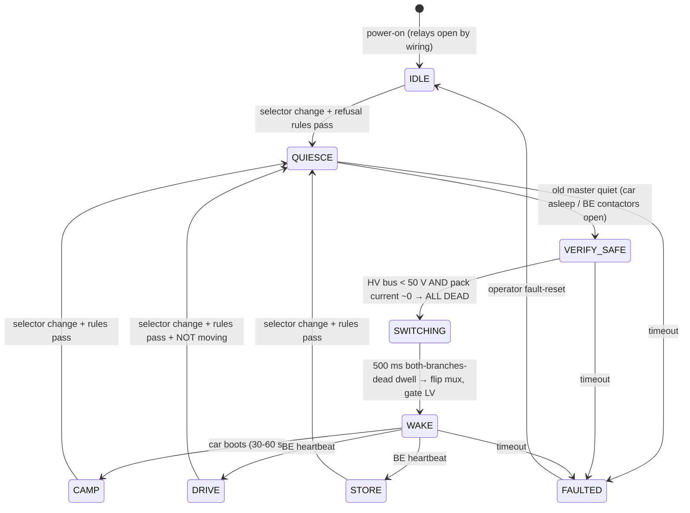

# modeswitch — SS09a pack-master mode handoff supervisor

The Slipstream flagship's Tesla pack serves three lives — camping (the donor car-brain
runs HVAC/screen/app), driving (the open followdrive stack runs the motor), and winter
home-battery duty (Battery-Emulator feeds a hybrid inverter). **The pack's BMS can only
serve one master at a time.** This supervisor owns the switchover: a physical CAN mux,
an LV power gate for the whole car-ECU set, and — the actual invention — the sequence.

Design doc: `engineering/SS09a_CAN_Mux_Mode_Handoff.design.md`. Status: state machine
complete + natively tested; CAN/ADC shims are bench TODOs (Phase A).

## The sequence (every transition, no exceptions)

Refusal rules (supervisor says no, stays put): DRIVE needs the 7-pin present · can't
enter CAMP or leave DRIVE while moving · no transitions mid-charge · estop = instant
nobody-is-master. FAULTED = mux open, car LV off, alarm — which is just safe idle:
the worst possible failure is "nobody is boss," and nobody-is-boss is harmless.

Never switched, ever: HVIL loop, pack 12V keep-alive, pyro wiring. The mux touches
the pack's signal CAN pair only (X098 pins 16/15, stub < 30 cm, per-branch 120 Ω).

## Files

- `state_machine.h` — the whole brain, pure C++, zero hardware dependencies
- `test_native.cpp` — 24 assertions: happy paths, every refusal, fault + reset, estop.
  Run anywhere: `g++ -std=c++17 test_native.cpp -o test && ./test`
- `main.cpp` — ESP32 shell: pins, relays, CAN shims (bench TODOs marked)

## Bench plan (Gate A add-ons)

1. BMS wake choreography under BOTH masters through the mux — the gating unknown
2. Octovalve parks in drive position before car-brain power-down
3. HV divider calibration; car-awake detection threshold; BE contactor-open frame
4. Full CAMP→STORE→DRIVE→CAMP cycle on the bench pack, logged and published

MIT license. This module is the flagship's first standalone release — it ships
before the trailer exists.
